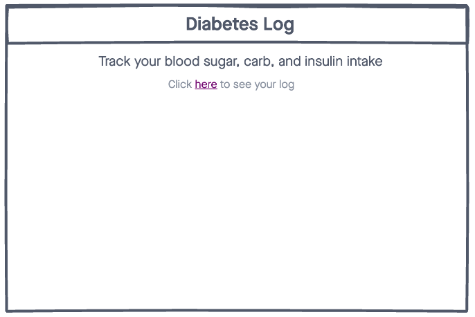
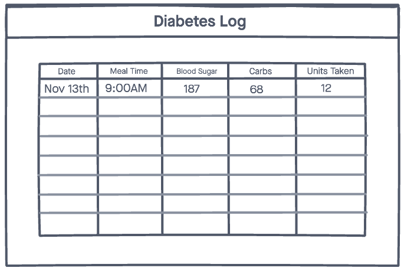
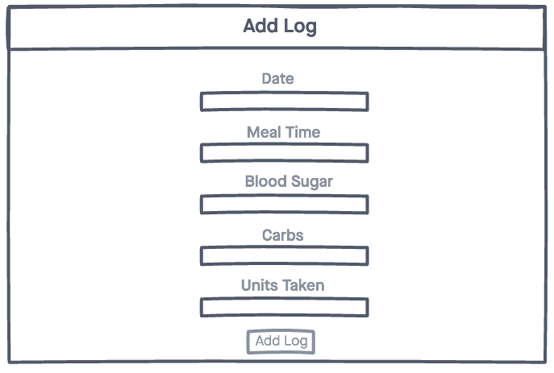
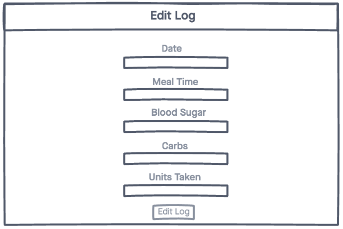
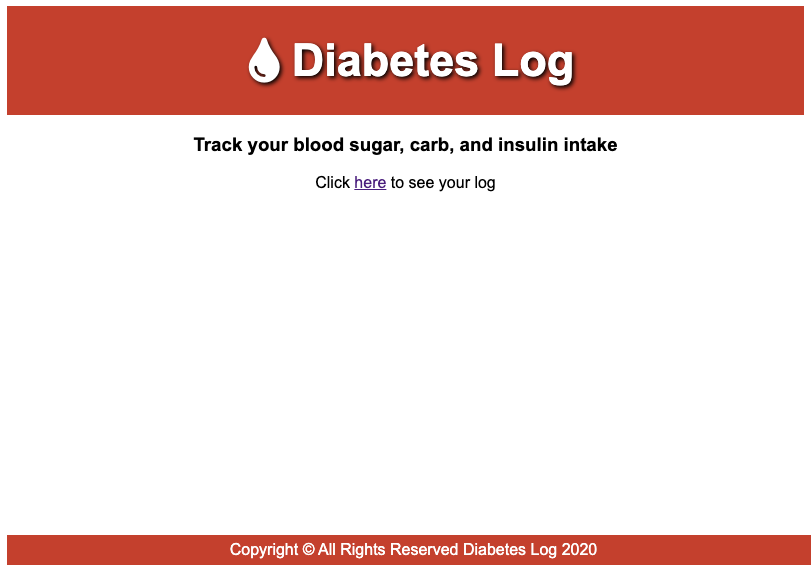
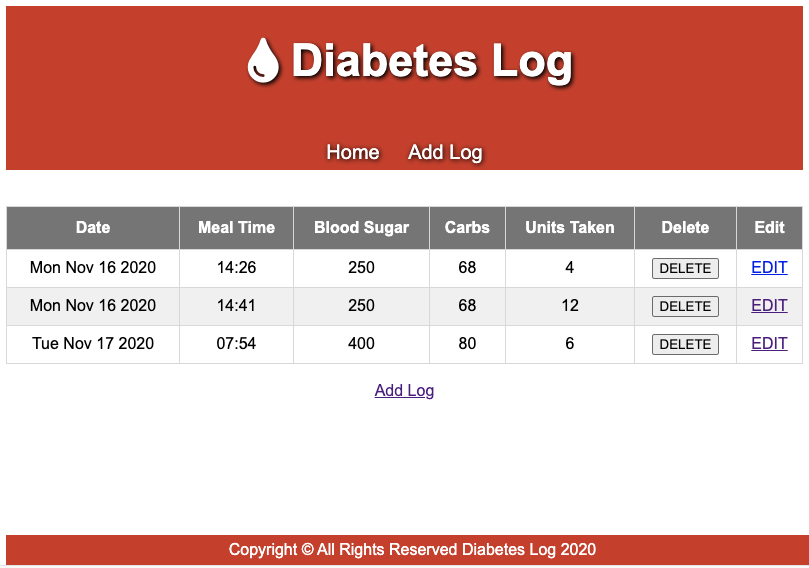
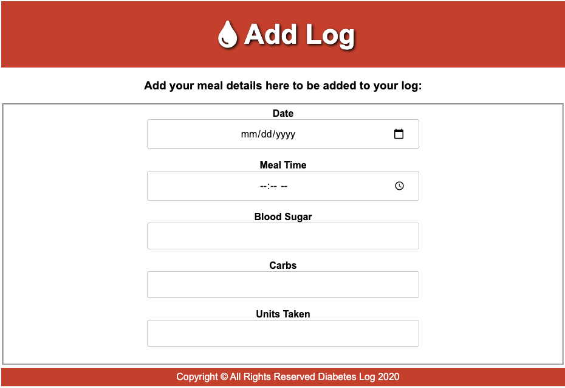
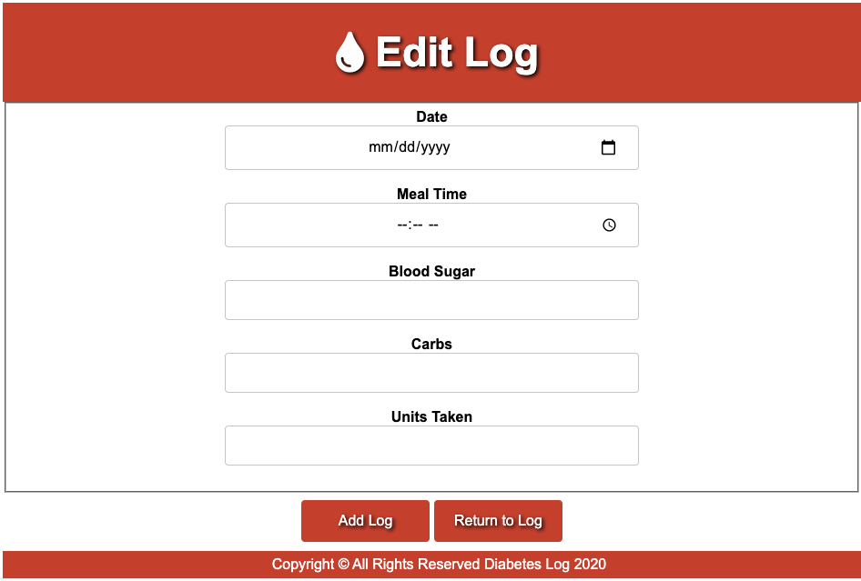

# Diabetes Log

A simple web application that allows you to track your blood sugar, carb, and insulin intake

## Technologies Used:
- HTML5
- CSS3
- JavaScript
- Express.js
- Node.js
- Mongoose.js
- MongoDB
- Morgan
- EJS
- Font Awesome

## Wireframes:

## Screenshots of Webpage:

## Getting Started:

## Next Steps: